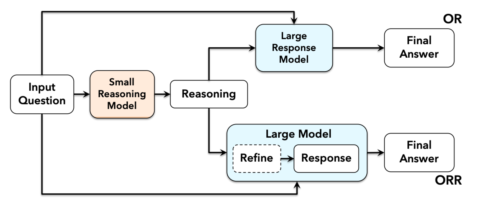

## Offloaded Reasoning: Efficient Inference for Large Language Models via Modular Reasoning and Refinement



Accepted at EMNLP 2025, more information coming soon.

# Citation

```
@inproceedings{jindal2025offloaded,
    title={Offloaded Reasoning: Efficient Inference for Large Language Models via Modular Reasoning and Refinement},
    author={Ishan Jindal and Jayant Taneja and Badrinath Chandana and Vikas Kapur and SACHIN DEV SHARMA},
    booktitle={The 2025 Conference on Empirical Methods in Natural Language Processing},
    year={2025},
    url={https://openreview.net/forum?id=aHzE5bt0Ca}
}
```